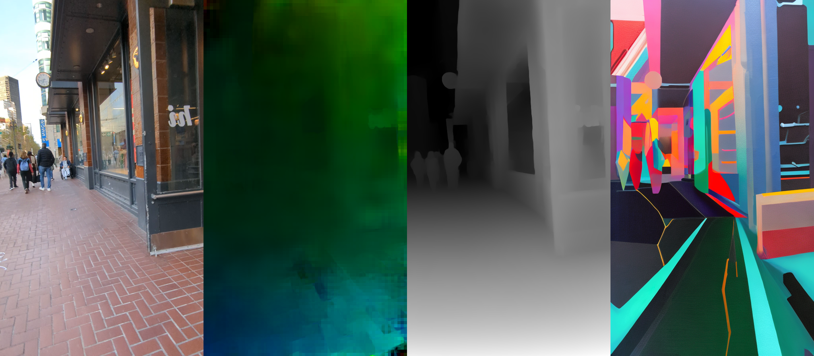
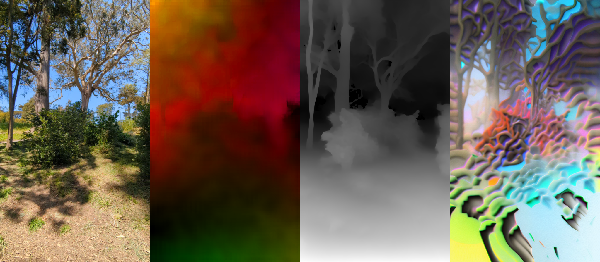

A CLI tool for applying Stable Diffusion Img2Img with ControlNets to videos, with stabilization provided by feeding back the prior output frame as a partial init image. The input frames are fed in as the ControlNet control image through the appropriate detector.

# Installation

## Pre-requisites

You may wish to set up a venv and activate it before installing the dependencies. 

```
python3 -m venv venv
source venv/bin/activate
```

Now, install the dependencies using pip3:

```
pip3 install \
  diffusers \
  torch \
  torchvision \
  xformers \
  click \
  moviepy \
  opencv-python \
  controlnet_aux \
  transformers
```

# Example

To process a video using _Stable Diffusion 2.1_ and a _ControlNet_ trained for __depth-to-image__ generation:

```
python3 controlnetvideo.py \
	PXL_20230422_013745844.TS.mp4 \
	--controlnet depth21 \
	--prompt 'graffuturism colorful intricate heavy detailed outlines' \
	--prompt-strength 9 \
	--show-input \
	--show-detector \
	--show-motion \
	--dump-frames '{instem}_frames/{n:08d}.png' \
	--init-image-strength 0.4 \
	--color-amount 0.3 \
	--feedthrough-strength 0.001 \
	--show-output \
	--num-inference-steps 15 \
	--duration 60.0 \
	--start-time 10.0 \
	--skip-dumped-frames \
	'{instem}_out.mp4'
```

This will process the file PXL_20230422_013745844.TS.mp4, starting at 10 seconds for a duration of 60 seconds. It will process each input frame using the appropriate detector for the pretrained _ControlNet_ for __depth-to-image__ generation, and then diffuse for 15 steps the first frame and `int( (1 - init-strength:0.4) * steps:15) = 9` steps all following frames, with the prompt 'graffuturism colorful intricate heavy detailed outlines' with a strength of 9, and full controlnet guidance strength. 

During processing, it will show the input, the detector output, the motion estimate, and the output frames, by writing them to a combined image in a directory `PXL_20230422_013745844.TS_frames/`. If you just want a single image file you can watch with a viewer which auto-refreshes upon the file changing on disk, then you can specify a --dump-frames without the `{n}` substitution, which is what causes the numbered files to be generated. 



Finally, it will also encode and write the output to a video file `PXL_20230422_013745844.TS_out.mp4`.

<video src="./examples/PXL_20230422_013745844.TSb_out.mp4"/>

Here's another example of the same video, but with a different prompt and different parameters:

```
python3 controlnetvideo.py \
        PXL_20230419_205030311.TS.mp4 \
        --controlnet depth21 \
        --prompt 'mirrorverse colorful intricate heavy detailed outlines' \
        --prompt-strength 10 \
        --show-input \
        --show-detector \
        --show-motion \
        --dump-frames '{instem}_frames/{n:08d}.png' \
        --init-image-strength 0.525 \
        --color-amount 0.2 \
        --feedthrough-strength 0.0001 \
        --show-output \
        --num-inference-steps 16 \
        --skip-dumped-frames \
        --start-time 0.0 \
        '{instem}_out.mp4'
```

And a progress frame:



And the output video:

<video src="./examples/PXL_20230422_013745844.TSb_out.mp4"></video>


# Usage

```
Usage: controlnetvideo.py [OPTIONS] INPUT_VIDEO OUTPUT_VIDEO

Options:
  --start-time FLOAT              start time in seconds
  --end-time FLOAT                end time in seconds
  --duration FLOAT                duration in seconds
  --max-dimension INTEGER         maximum dimension of the video
  --min-dimension INTEGER         minimum dimension of the video
  --round-dims-to INTEGER         round the dimensions to the nearest multiple
                                  of this number
  --prompt TEXT                   prompt used to guide the denoising process
  --negative-prompt TEXT          negative prompt, can be used to prevent the
                                  model from generating certain words
  --prompt-strength FLOAT         how much influence the prompt has on the
                                  output
  --num-inference-steps, --steps INTEGER
                                  number of inference steps, depends on the
                                  scheduler, trades off speed for quality.
                                  20-50 is a good range from fastest to best.
  --controlnet [aesthetic|lineart21|hed|hed21|canny|canny21|openpose|openpose21|depth|depth21|normal|mlsd]
                                  which pretrained controlnet annotator to use
  --controlnet-strength FLOAT     how much influence the controlnet
                                  annotator's output is used to guide the
                                  denoising process
  --fix-orientation / --no-fix-orientation
                                  resize videos shot in portrait mode on some
                                  devices to fix incorrect aspect ratio bug
  --init-image-strength FLOAT     the init-image strength, or how much of the
                                  prompt-guided denoising process to skip in
                                  favor of starting with an existing image
  --feedthrough-strength FLOAT    the ratio of input to motion compensated
                                  prior output to feed through to the next
                                  frame
  --motion-alpha FLOAT            smooth the motion vectors over time, 0.0 is
                                  no smoothing, 1.0 is maximum smoothing
  --motion-sigma FLOAT            smooth the motion estimate spatially, 0.0 is
                                  no smoothing, used as sigma for gaussian
                                  blur
  --show-detector / --no-show-detector
                                  show the controlnet detector output
  --show-input / --no-show-input  show the input frame
  --show-output / --no-show-output
                                  show the output frame
  --show-motion / --no-show-motion
                                  show the motion transfer (not implemented
                                  yet)
  --dump-frames PATH              write intermediate frame images to a
                                  file/files during processing to visualise
                                  progress. may contain various {}
                                  placeholders
  --skip-dumped-frames            read dumped frames from a previous run
                                  instead of processing the input video
  --dump-video                    write intermediate dump images to the final
                                  video instead of just the final output image
  --color-fix [none|rgb|hsv|lab]  prevent color from drifting due to feedback
                                  and model bias by fixing the histogram to
                                  the first frame. specify colorspace for
                                  histogram matching, e.g. 'rgb' or 'hsv' or
                                  'lab', or 'none' to disable.
  --color-amount FLOAT            blend between the original color and the
                                  color matched version, 0.0-1.0
  --color-info                    print extra stats about the color content of
                                  the output to help debug color drift issues
  --canny-low-thr FLOAT           canny edge detector lower threshold
  --canny-high-thr FLOAT          canny edge detector higher threshold
  --mlsd-score-thr FLOAT          mlsd line detector v threshold
  --mlsd-dist-thr FLOAT           mlsd line detector d threshold
  --help                          Show this message and exit.

```
